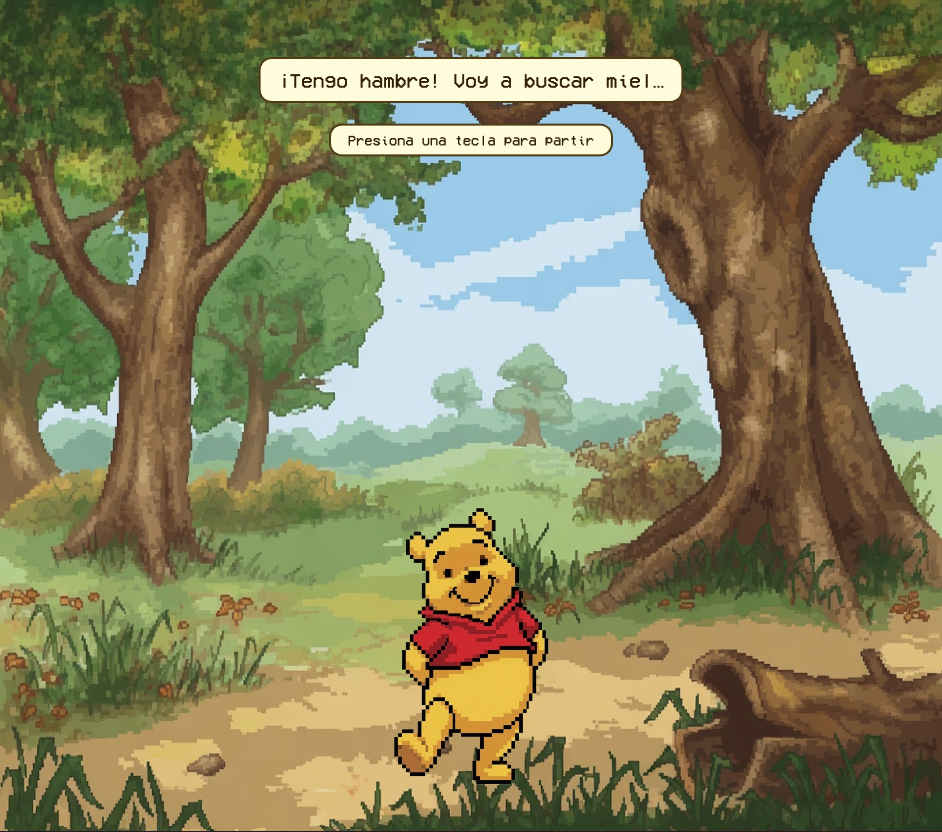
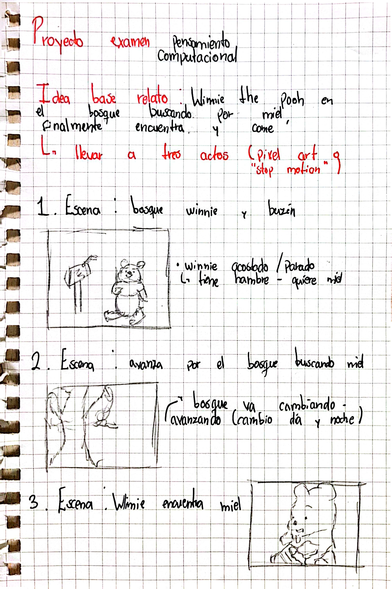

## Link de web pública (github pages)

<https://piromantico.github.io/proyecto-pensamiento-computacional-s5/>

### Título del proyecto

El osito bobito te invita en la búsqueda de su miel 

### Referencia de origen / bibliografía

Serie 'Winnie The Pooh', 	
John Lounsbery, 1977.

### Imagen de referencia de proyecto



### Integrantes

Alejandro Fernández [usuarioGithub](https://github.com/piromantico)

### Enlace de p5.js 

https://editor.p5js.org/luxinocte/sketches

### Relato inicial

Winnie the Pooh se encuentra en el bosque cuando de repente siente hambre, decide tomar acción e irse a buscar miel.

### Storyboard



### Estados

#### Estado 0: INICIO

Se presenta la primera instrucción, presionar una tecla para iniciar, al presionar cualquiera se pasa al estado 1

```js
function dibujar_inicio() {
  image(fondo1, 0, 0, width, height);
  nube_texto('¡El osito bobito te invita en la búsqueda de su miel!', width / 2, height / 2);
  nube_texto('Presiona cualquier tecla para comenzar', width / 2, 470, 14);
}

function keyPressed() {
  if (estado === E.INICIO) {
    estado = E.CON_EL_MEDIO_DIENTE;
    cancion.play();
    cancion.setVolume(0.9);
    musicaIniciada = true;
    tiempoInicio   = millis();
  }
}
```

#### Estado 1: CON EL MEDIO DIENTE

Pooh tiene el medio diente y decide ir en búsqueda de miel, se presiona una tecla para empezar la búsqueda

```js
function dibujar_dialogo_hambre() {
  image(fondo1, 0, 0, width, height);
  image(pooh, width/2 - POOH_W/2, POOH_Y, POOH_W, POOH_H);
  nube_texto('¡Tengo hambre! Voy a buscar miel…', width / 2, 80);
  nube_texto('Presiona una tecla para partir', width / 2, 140, 14);
}

// en keyPressed():
else if (estado === E.CON_EL_MEDIO_DIENTE) {
  estado = E.NOS_JUIMOS;
  ultimo_cambio_fondo    = millis();
  tiempo_inicio_caminata = millis();
  pooh_x = -POOH_W;
}
```

#### Estado 2: NOS JUIMOS

Pooh camina de izquierda a derecha y el fondo va alternando entre día y noche por 10 segundos, después se para en el fondo del árbol de miel al presionar una tecla, pasando así al estado 3.

```js
function dibujar_caminando() {
  let transcurrido = millis() - tiempo_inicio_caminata;

  if (transcurrido < DURACION_INTERCALADO) {
    if (millis() - ultimo_cambio_fondo > VELOCIDAD_FONDO) {
      es_dia = !es_dia;
      ultimo_cambio_fondo = millis();
    }
    image(es_dia ? fondo1 : fondo2, 0, 0, width, height);
  } else {
    image(img_miel1, 0, 0, width, height);
  }

  pooh_x += VELOCIDAD_POOH;
  if (pooh_x > width) { pooh_x = -POOH_W; }

  let img_actual = (frame_caminata === 0) ? camina1 : camina2;
  image(img_actual || pooh, pooh_x, POOH_Y, POOH_W, POOH_H);

  nube_texto('Buscando miel por el bosque…', width / 2, 80);
  nube_texto('Presiona una tecla al llegar', width / 2, 140, 14);
}

// en keyPressed():
else if (estado === E.NOS_JUIMOS) {
  estado = E.LLEGO_LA_MIEL_CASERITO;
}
```

#### Estado 3: LLEGÓ LA MIEL CASERITO

Pooh por fin encuentra miel y aparece junto al árbol mirándola, toda la pantalla se vuelve clickeable para agarrar la miel, al clickear se pasa al estado 4

```js
function dibujar_llego_miel() {
  image(img_miel1, 0, 0, width, height);
  image(img_poohladito, POOH_MIEL_X, POOH_Y, POOH_W, POOH_H);
  if (DEBUG_MIEL) {
    noFill(); stroke(255, 0, 0); strokeWeight(2);
    rect(MIEL_X, MIEL_Y, MIEL_W, MIEL_H);
    noStroke();
  }
  nube_texto('¡Haz click en la miel!', width / 2, 80);
}

function mousePressed() {
  if (estado === E.LLEGO_LA_MIEL_CASERITO) {
    if (mouseX > MIEL_X && mouseX < MIEL_X + MIEL_W &&
        mouseY > MIEL_Y && mouseY < MIEL_Y + MIEL_H) {
      estado = E.TA_SERVIO;
    }
  }
}
```

#### Estado 4: TA SERVIO'

Pooh agarra la miel y aparece el fondo con la miel vacía ya que la tiene en sus manos, hay que hacer scroll para que coma

```js
function dibujar_decision() {
  image(img_mielagarrada, 0, 0, width, height);
  image(img_poohagarro, POOH_MIEL_X, POOH_Y, POOH_W, POOH_H);
  nube_texto('¡Encontré la miel, comeré jeje!', width / 2, 80);
  nube_texto('(scroll up para comer)', width / 2, 165, 14);
}

function mouseWheel(event) {
  if (estado === E.TA_SERVIO && event.delta > 0) {
    estado = E.QUEDE_POCHITO;
  }
  return false;
}
```

#### Estado 5: QUEDÉ POCHITO

Pooh come la miel y queda pochito, hacer scroll  reinicia el coedigo

```js
function dibujar_comiendo() {
  if (img_miel) {
    image(img_miel, 0, 0, width, height);
  } else {
    image(fondo1, 0, 0, width, height);
  }
  image(img_poohcomio, POOH_MIEL_X, POOH_Y, POOH_W, POOH_H);
  nube_texto('¡Qué rica miel! jeje', width / 2, 80);
  nube_texto('(scroll down para volver a empezar)', width / 2, 120, 14);
}

function mouseWheel(event) {
  if (estado === E.QUEDE_POCHITO && event.delta < 0) {
    reiniciar();
  }
  return false;
}
```

### Uso de IA

Se utilizó IA para la creaciíon de imagenes y sus variables: Grok - Plan Gratuito
Se utiizí IA para asistir en el entendimiento y optimización del código: Claude - Plan Gratuito

